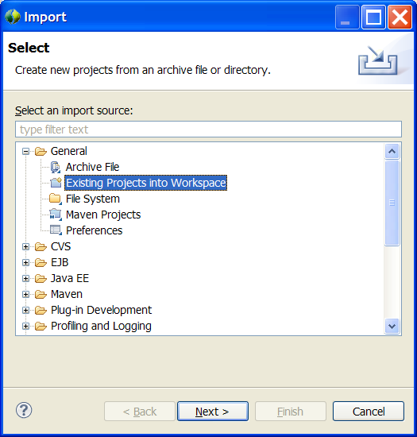
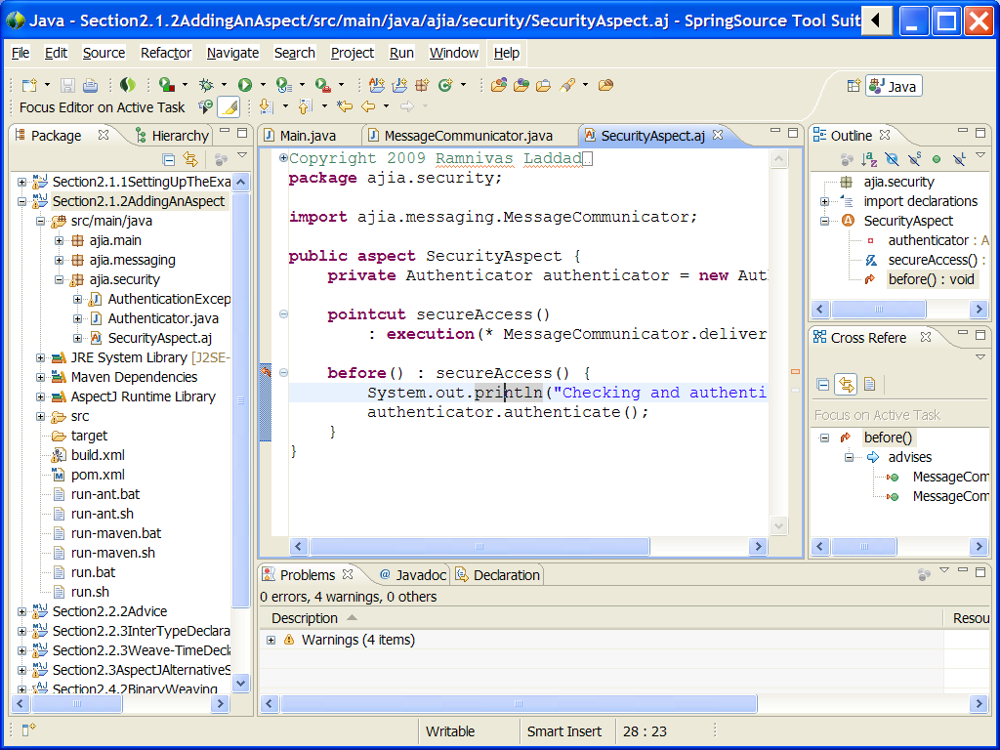

# [AspectJ in Action, Second Edition](https://www.manning.com/books/aspectj-in-action-second-edition) by [Ramnivas Laddad](http://ramnivas.com)

## What\'s included

-   Code for all chapters along with build scripts.
-   Parent pom.xml files and a shared CommonPointcuts project.

All build scripts are optimized for simplicity of distribution (for
example, the top-most parent POM declares dependencies for all projects
even though not all projects need all dependencies).

> ## Getting support
>
> While a lot of care has been put into preparing the source packages,
> you may encounter issues that are most likely related to either your
> platform or the version of tools you use. In most cases, you will be
> able to resolve issues by examining the failure and adjusting your
> environment. However, if you get stuck, the best way to resolve such a
> problem is by visiting the [book\'s
> forum](http://www.manning-sandbox.com/forum.jspa?forumID=413). You can
> search if the problem you encountered has been already posted and
> resolved. If not, you can post a new message. **Please use this forum
> to post questions directly related to the book and book\'s source code
> only.**
>
> For general AspectJ questions, the best place to visit is [AspectJ
> Mailing List](https://dev.eclipse.org/mailman/listinfo/aspectj-users).
>
> For general Spring AOP questions, the best place to visit is
> [Spring\'s AOP
> forum](http://forum.springsource.org/forumdisplay.php?f=31).
>
> **Any suggestions to improve the user experience are welcome.**

## Prerequisite

The specified version for each component represents the tested version;
a higher version may work as well.

1.  [Java SE Development Kit (JDK) 17 ](https://jdk.java.net/17/)
2.  [Maven 3.8.4](http://maven.apache.org/download.html) [(Important:
    Lower versions of Maven may not work with some of the
    projects.)]{.warning}
3.  [Ant 1.10.12](http://ant.apache.org/bindownload.cgi) (Optional for
    Maven users)
4.  [AspectJ 1.9.7](http://eclipse.org/aspectj)

I assume that you have set your PATH environment variable to include
JDK, AspectJ Maven, and Ant binaries.

## Installation

1.  From the top-level directory (where this HTML file resides), type
    the following command:

    ## For Windows

    \> install.bat

    ## For Unix systems including Mac OS X

    \$ ./install.sh

    This will install the parent POMs and common projects to the local
    Maven repository.

2.  (Optional for Maven users) Modify build.properties in the top-level
    directory to point to the AspectJ home directory

3.  (Optional for Maven and Ant users) Modify (depending on your
    platform) setHomes.bat or setHomes.sh to match your environment.

## Running from shell

For each section, you will find run.bat/run.sh or multiple
run\*.bat/run\*.sh scripts. Each of these scripts execute appropriate
Maven goals, Ant targets, or shell commands and, in some cases, perform
needed setup.

> Each run\*.bat and run\*.sh script, in most cases, is a simple wrapper
> around \'mvn\' (and in some chapters, \'ant\'). These shell scripts
> are provided for convenience that show the expected commands matching
> the text in the book. You may directly execute \'mvn\' if you so
> choose.

Note: You must execute install.bat or install.sh (which will require you
to install Maven) before you can successfully execute these commands
(even those that don\'t use Maven)

> Maven stack traces often take a bit of careful reading to understand
> the real error. For example, in Section5.6SofteningCheckedException,
> you will need to observe the stack trace carefully to see that the
> real reason is org.aspectj.lang.SoftException, which correctly
> illustrates the example in the book.

## Setting up Eclipse

The Eclipse distribution available with [SpringSource Tools
Suite](http://www.springsource.com/products/sts) is *highly*
recommended, since it comes preconfigured with all required plugins.

Alternatively, you may install [Eclipse 3.5 (Java EE
edition)](http://www.eclipse.org/downloads/) followed by installation of
the [m2Eclipse](http://m2eclipse.codehaus.org/),
[AJDT](http://eclipse.org/ajdt), and [Spring IDE](http://springide.org)
plugin.

Each chapter is packaged in Eclipse workspace style (but without the
workspace metadata). For example, for chapter 3, you will find the
ch03/workspace directory. For each chapter that you want to try, follow
these steps (You will need to perform this step only once for each
chapter):

1.  Start STS or Eclipse. When prompted for the workspace, point to the
    \'workspace\' directory of the chapter. 

2.  Import the existing projects by invoking
    1.  File-\>Import\... 
    2.  In the dialog box that appears, choose General/Existing Projects
        into Workspace [(Warning: Do not choose Maven
        Projects.)]{.warning} 

    You may get a prompt to enable AJDT weaving, choose \"Yes\" and let
    Eclipse restart. This will happen only once per installation of
    Eclipse.

3.  Let the workspace refresh complete\... now you know what to do!
    

    > You need to launch a few applications using the load-time weaver.
    > Look for a file with .launch extension (such as
    > LoadTimeWeaver.lauch in chapter 2) in Eclipse package explorer.
    > You can launch such a file through \"Run As\" menu.
    >
    > If a launch file is provided, executing the driver or tests
    > without it will likely result in unexpected output or test
    > failures.

## Known issues

-   Although each project is Maven enabled, importing it as Maven
    Project leads to unexpected issues.
